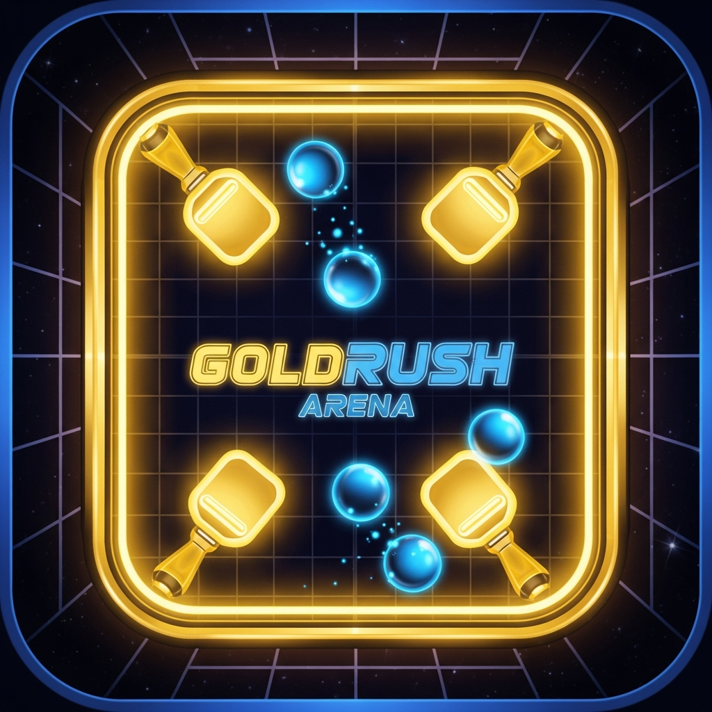

<p align="center">
  
</p>

<h1 align="center">GoldRush Arena</h1>

<p align="center">
  <b>A fast-paced 4-player air-hockey battle royale for iOS & Android.</b><br/>
  Deflect the ball. Eliminate opponents. Earn XP. Climb 23 ranks. Be the last one standing.
</p>

<p align="center">
  
  
  
  
  
</p>

---

## Table of Contents

- [Overview](#overview)
- [Features](#features)
- [Tech Stack](#tech-stack)
- [Getting Started](#getting-started)
- [Project Structure](#project-structure)
- [Game Modes](#game-modes)
- [Progression System](#progression-system)
- [Algorithms](#algorithms)
- [App Store Preparation](#app-store-preparation)
- [Roadmap](#roadmap)
- [Known Issues](#known-issues)
- [License](#license)

---

## Overview

**GoldRush Arena** is a last-one-standing arcade game inspired by air hockey and battle royale mechanics. You control a paddle on one wall of a square arena. A ball bounces around -- let it past your paddle and you lose a life. Lose all lives and you're eliminated. The last player standing wins.

Every match feeds into a deep progression system with **23 ranks**, **14 paddle skins**, **10 upgradeable relics**, **3 super abilities**, a **25-milestone Trophy Road**, and competitive time-limited **events**.

The game is built with **Expo SDK 54** and runs on **iOS**, **Android**, and **Web**. It is **100% offline** -- no account or internet required to play. All progress is saved locally on the device.

---

## Features

### Gameplay
- **4-Player Battle Royale** -- 1 human + 3 AI bots on a square arena
- **Dynamic Arena Shapes** -- Arena transitions from square (4P) to triangle (3P) to duel (1v1) as players are eliminated
- **6 Distinct Game Modes** -- Classic, Rumble, Chaos, Six-Player, Gauntlet, and Casual
- **Smart Bot AI** -- Threat-based targeting with configurable difficulty and rank-appropriate skills
- **Power-Up System** -- Shield, Speed Boost, Shrink Opponents, Extra Life, and Multiball pickups
- **Super Abilities** -- Charge during matches: Iron Wall, Slow Field, and Banish
- **Spectator Mode** -- Watch the match continue after elimination with early-exit rewards
- **Screen Shake, Haptics, and Particle Effects** -- Immersive feedback on every action

### Progression
- **23 Ranks** -- From Iron through Spartan 3 (820,000+ XP)
- **Halo-Style Competitive Level** -- Independent 1-50 ranking system
- **25 Trophy Road Milestones** -- Earn skins, relics, coins, and XP boosts
- **10 Upgradeable Relics** -- Passive battle bonuses with 10 levels each (Clash Royale style)
- **14 Unlockable Skins** -- From Classic to Cosmic with unique glow effects
- **8 Arena Themes** -- Rank-unlocked environments with gameplay modifiers
- **Forge Shop** -- Spend Credits on powerful post-endgame abilities
- **Daily Login Streaks** -- Escalating coin rewards for consecutive days
- **Win Streak Multipliers** -- Up to 2x rewards for consecutive wins

### Events (General 1+ Rank)
| Event | Schedule | Max Plays |
|-------|----------|-----------|
| Weekly Challenge | Resets every Monday | 5/week |
| Monthly Cup | Opens the 28th of each month | 3/month |
| Annual Grand Prix | Opens October 28th each year | 2/year |

### Technical
- 60 FPS game loop with frame-rate-independent physics
- React Native Animated API for smooth UI transitions
- Web Audio API sound effects (web) / expo-haptics (native)
- AsyncStorage for device-local persistence
- File-based navigation with Expo Router 6
- Full TypeScript strict mode coverage
- Error boundaries and crash recovery

---

## Tech Stack

| Layer | Technology |
|-------|------------|
| Framework | Expo SDK 54, React Native 0.81.5 |
| Language | TypeScript 5.9 (strict mode) |
| Navigation | Expo Router 6 (file-based routing) |
| State Management | React Context API |
| Persistence | AsyncStorage (device-local) |
| Fonts | Inter via `@expo-google-fonts/inter` |
| Animations | React Native Animated API |
| Audio | Web Audio API (web) / expo-av (native v1.1) |
| Haptics | expo-haptics |
| Build | EAS Build |

---

## Getting Started

### Prerequisites
- Node.js 18+
- pnpm (enforced via preinstall hook)
- Expo Go app on your phone (optional, for mobile testing)

### Installation

```bash
# Clone the repository
git clone https://github.com/ayaanpopatiya101-png/goldrush-arena.git
cd goldrush-arena

# Install dependencies (pnpm is required)
pnpm install

# Start the mobile development server
pnpm --filter @workspace/mobile run dev
```

Then scan the QR code with **Expo Go** (iOS/Android) or press **W** to open in your browser.

### Type Checking

```bash
# Type-check the entire workspace
pnpm run typecheck

# Type-check mobile app only
pnpm --filter @workspace/mobile run typecheck
```

---

## Project Structure

```
goldrush-arena/
|-- artifacts/
|   |-- mobile/              # Main mobile game application
|   |   |-- app/             # Expo Router screens
|   |   |   |-- (tabs)/      # Tab screens (Home, Shop, Events, Profile...)
|   |   |   |-- game.tsx     # In-match screen
|   |   |   |-- postgame.tsx # Results & rewards screen
|   |   |   |-- lobby.tsx    # Pre-match setup
|   |   |   |-- settings.tsx # App settings
|   |   |   |-- onboarding.tsx# First-time user tutorial
|   |   |   |-- gauntlet.tsx # 3-round tournament mode
|   |   |-- components/
|   |   |   |-- GameArena.tsx     # Core game engine (physics, AI, rendering)
|   |   |   |-- CinematicSplash.tsx # Animated splash screen
|   |   |   |-- TutorialOverlay.tsx # Interactive tutorial
|   |   |   |-- RelicCharacter.tsx  # Relic equip/upgrade UI
|   |   |   |-- ...
|   |   |-- context/
|   |   |   |-- PlayerContext.tsx   # All player state (XP, coins, skins, relics)
|   |   |-- store/
|   |   |   |-- gameSession.ts     # Temporary match config
|   |   |   |-- gauntletSession.ts # Gauntlet tournament state
|   |   |-- hooks/
|   |   |   |-- useSettings.ts     # Player preferences
|   |   |   |-- useSoundFX.ts      # Sound effect management
|   |   |   |-- useColors.ts       # Theme color utilities
|   |   |-- constants/
|   |   |   |-- colors.ts          # App color palette
|   |   |-- assets/                # Images, fonts, audio
|   |-- api-server/              # Backend API (future)
|   |-- mockup-sandbox/          # UI prototyping
|-- lib/                         # Shared libraries
|   |-- api-spec/                # API type definitions
|   |-- api-client-react/        # API client hooks
|   |-- api-zod/                 # Schema validation
|   |-- db/                      # Database schema
|-- scripts/                     # Build & utility scripts
|-- PRD.md                       # Product Requirements Document
|-- ALGORITHMS.md                # Game algorithm documentation
|-- APP_STORE_ROADMAP.md         # App Store submission guide
```

---

## Game Modes

| Mode | Description | XP Multiplier |
|------|-------------|---------------|
| **Classic** | Standard 4-player ranked match | 1.0x |
| **Rumble** | Faster ball speed, more chaotic | 1.2x |
| **Chaos** | Multiple balls simultaneously | 1.5x |
| **Six-Player** | 6 paddles, 6 walls | 1.75x |
| **Gauntlet** | 3-round tournament, cumulative XP | 3.0x |
| **Casual** | No rank impact, lower rewards | 0.8x |

---

## Progression System

### Ranks (23 Total)

| Tier | Ranks | XP Range |
|------|-------|----------|
| Starter | Iron, Bronze, Silver | 0 -- 1,800 |
| Core | Gold, Platinum, Diamond | 3,000 -- 12,000 |
| Master | Master 1-3 | 14,000 -- 30,000 |
| Legend | Legend 1-3 | 42,000 -- 76,000 |
| Military | Recruit, Private, Corporal, Sergeant, Lieutenant, Commander | 100K -- 282K |
| Elite | General 1-3, Spartan 1-3 | 340K -- 820K+ |

### Trophy Road (25 Milestones)

Earn rewards at XP thresholds:
- **Skins**: Plasma, Frost, Toxic, Void, Inferno, Chrome, Cosmic
- **Relics**: Ironhide, Longarm, Quicksilver, Second Wind, Aftershock, Time Warp, Bulwark, Phoenix, Midas
- **Coins**: 200 -- 2,000 per milestone

### Win Streak Bonus

| Streak | Multiplier |
|--------|------------|
| 1 win | 1.0x |
| 2 wins | 1.25x |
| 3 wins | 1.5x |
| 4 wins | 1.75x |
| 5+ wins | 2.0x |

---

## Algorithms

The game engine uses several sophisticated algorithms:

### 1. Physics Engine
- **Frame-rate independent game loop** with delta-time normalization
- **Ball collision detection** with paddle velocity-based deflection angles
- **Speed capping** to prevent ball tunneling at high velocities
- **Dynamic arena transitions** (square -> triangle -> duel) based on alive player count

### 2. Bot AI System
- **Threat-based targeting** -- bots prioritize the ball with highest collision threat
- **Configurable difficulty** -- Easy (0.62x speed, 2.2x inaccuracy) vs Normal
- **Rank-appropriate relics** -- bots equip relics matching their rank
- **Skill scaling** -- bot accuracy and speed scale with human player's rank
- **Super ability usage** -- bots charge and activate supers with randomized timing

### 3. Progression Algorithms
- **XP-to-Level**: `level = floor((xp / 80) ^ 0.72) + 1`
- **Rank determination**: Linear XP threshold lookup across 23 ranks
- **Halo-style competitive level**: +2 for 1st place, 0 for 2nd, -1 for early elimination
- **Streak multiplier**: Step function up to 2.0x at 4+ consecutive wins
- **Relic scaling**: Linear interpolation L1->L10 for numeric stats

See [ALGORITHMS.md](./ALGORITHMS.md) for full mathematical documentation.

---

## App Store Preparation

### iOS (App Store)
- Bundle ID: `com.goldrush.arena`
- Portrait orientation only
- Dark mode UI enforced
- ITSAppUsesNonExemptEncryption: false
- Privacy Policy and Terms of Service included in-app

### Android (Google Play)
- Package: `com.goldrush.arena`
- Target API level 34+
- No dangerous permissions required
- Adaptive icon support

### Before Submitting
1. Replace placeholder Privacy Policy URL in `app/settings.tsx`
2. Add real Privacy Policy link in App Store Connect
3. Capture screenshots from a physical device via TestFlight
4. Confirm bundle IDs match your Apple/Google developer accounts
5. Run: `eas build --platform all --profile production`

See [APP_STORE_ROADMAP.md](./APP_STORE_ROADMAP.md) for the complete submission checklist.

---

## Roadmap

### v1.0 (Current) -- App Store Ready
- [x] Core 4-player battle royale gameplay
- [x] 6 game modes
- [x] 23-rank progression system
- [x] 10 relics with upgrade paths
- [x] Trophy Road with 25 milestones
- [x] Daily login streaks
- [x] Events system (weekly/monthly/annual)
- [x] Complete UI/UX with dark theme
- [x] Tutorial and onboarding flow

### v1.1 -- Audio & Polish
- [ ] Native audio via `expo-av` (iOS/Android sound effects)
- [ ] Background music tracks per arena theme
- [ ] Enhanced haptic feedback tuning
- [ ] Push notifications for daily challenges

### v1.2 -- Social Features
- [ ] Real-time multiplayer via WebSockets
- [ ] Cloud save with anonymous account linking
- [ ] Custom match lobbies (invite friends via code)
- [ ] Local leaderboards

### v2.0 -- Major Expansion
- [ ] Clan system
- [ ] Global leaderboards
- [ ] Seasonal battle pass
- [ ] Replay/watch system
- [ ] New arena themes and game modes

---

## Known Issues

| Issue | Severity | Status |
|-------|----------|--------|
| Delete account uses old storage key (`@goldrush_player_{user}` instead of `@goldrush_v3_{user}`) | Medium | Fix in progress |
| Audio only works on web (Web Audio API); native audio requires `expo-av` integration | Medium | Planned for v1.1 |
| App Store URLs are placeholders in `settings.tsx` | Low | Fix before submission |

See [BUGFIXES_AND_IMPROVEMENTS.md](./BUGFIXES_AND_IMPROVEMENTS.md) for the full list with code-level fixes.

---

## License

MIT License -- see LICENSE for details.

---

<p align="center">
  Built with Expo SDK 54 & React Native
</p>
